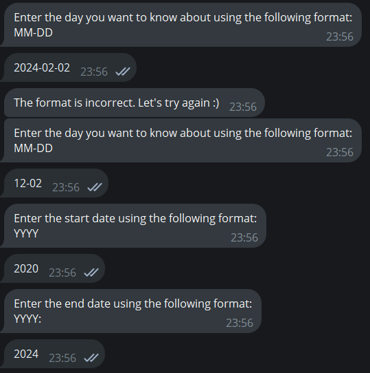

# weather_comp_bot

**Link:** https://t.me/weather_comp_bot.

Версия на русском: [README_RUS.md](README_RUS.md).

1. [Idea](#idea)
2. [How the bot works](#how-the-bot-works)
3. [Technology stack](#technology-stack)
4. [Deployment](#deployment)
5. [Using the bot](#using-the-bot)

## The idea
This small bot aims to collect information about the weather over the past (specified) period of time and conducts a small comparative analysis.

Sometimes, I'm curious about what the weather was like a year, five or ten years ago — and that's how this bot appeared :)

_Attention:_
* The bot only speaks English and would like to stay monolingual in the near future.
* The implementation of the idea from beginning to end is mine, all coincidences are truly random :)

## How the bot works
### Input data (the bot polls the user)
* **The city** for which information is needed.
* **The time period**.
* **Taking into account** all days in the interval or one specific day in the year.
* **Weather parameter**; available: temperature, feels like temperature, humidity and wind speed.

The last two parameters can be selected using buttons. For more information about the interface, see the section **[Using the bot](#using-the-bot)**.

### Output data
* **Graph**, based on values; intended just for illustrating the dynamics of events.
* **Duplication** of already entered information — just in case.
* **Maximum, minimum, and average** in the considered interval.
* **The number of** calculated parameters.

### Error handling
* Incorrect date entry is processed immediately, the bot tells the user about this.
    * The date cannot be later than this year and not earlier than 50 years (according to the used API).
* All other errors, e.g. incorrect city, error on the side of the weather service or API are reported to the user after entering all the data.

### Technical side
* Microservice architecture, and that's all. There are two services: the telegram bot service `telegram-bot-service` (port 8080) and the weather service `weather-service` (port 8081).
* The database is PostgreSQL. It is only needed to remember users, this happens in the `users` table. The table is automatically generated, it's not necessary to create it manually.
* Services communicate with each other over HTTP, responses are sent as json files.
* The weather service can be used separately, communication with it is possible via HTTP (use Postman or so).
* When the weather service is launched, the documentation of the weather service API is posted at: http://localhost:8081/swagger-ui/index.html .
* Tests can be run with the `mvn clean test` command. To view the report, run `mvn allure:serve`.

### Short but sweet
Despite its slightly informal speech, this bot is polite and punctual. It memorises the names of users when they first contact them, and greets them if the bot remembers the user.

## Technology stack
Java 17, Maven, Spring 3 (Boot, Data), Hibernate, Liquibase, PostgreSQL, Telegram Bots, JFreeChart, HTTP, REST API, JUnit 5, Mockito, Swagger (OpenAPI 3.0), Allure.

The weather API: https://visualcrossing.com The API key is available after registration (my key is already in the repository, however it's better to substitute your own, the basic tariff is free).

## Deployment
_Important notes:_
* When deploying with Docker in the `application.yml` of the `telegram-bot-service` service in `spring.datasource.url` should be `db`. When running locally, change it to `localhost`.
* The bot does not count on extraordinary popularity, so all the tokens and keys are left as is. You can replace the parameters of your bot in `application.yml`, `BotConfig.java ` and `BotConfigTest.java` of the `telegram-bot-service`.

### Using Docker
1) Make sure that in the `application.yml` every parameter of the bot and of the database is correct. 
2) Build both services: `mvn clean package`.
3) Launch containers: `docker-compose up --build`

### Locally
1) Create a PostgreSQL database `weatherbot_users`. Change the `application.yml` parameters: password and login. Make sure that the PostgreSQL service is running.
2) Build both services with the `mvn clean package` command.
3) Run the `bot-service` and `weather-service` services, either in the IDE or with the command `mvn spring-boot:run`

## Using the bot

Here you can see a couple of examples of interaction with a bot. You can look at the provided interface. It may vary slightly on different devices.

Attetion: lots of screenshots :)

### Case 1.

The bot met the user for the first time. (At least, the user's ID is not in the database.) He greets the user, remembers his name and polls him.

The bot immediately catches the mistakenly entered data format and reports it to the user.

### Case 2.

The bot recognized the user!

