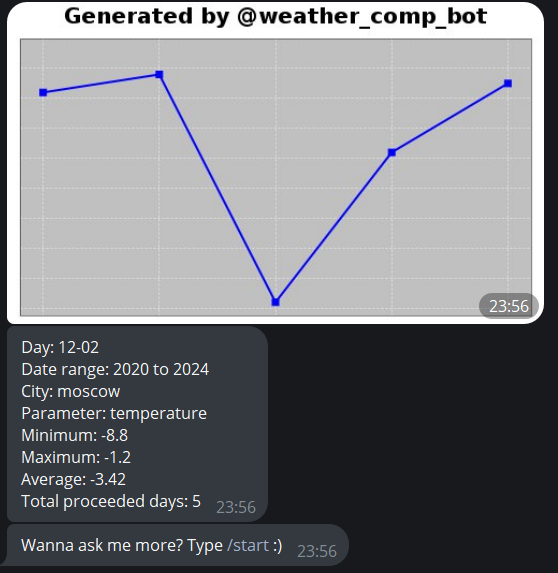
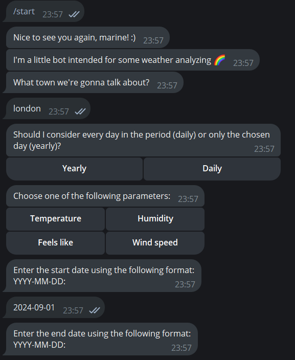

# weather_comp_bot

**Ссылка:** https://t.me/weather_comp_bot.

The English version: [README.md](README.md).

1. [Идея](#идея)
2. [Как работает бот](#как-работает-бот)
3. [Стек технологий](#стек-технологий)
4. [Развертывание](#развертывание)
5. [Использование бота](#использование-бота)

## Идея
Этот небольшой бот нацелен на то, чтобы собирать информацию о погоде за уже прошедший (указанный) промежуток времени и проводить небольшой сравнительный анализ. 

Мне периодически любопытно, какая погода была год, пять или десять лет назад — так и появился этот бот :)

_Внимание:_ 
* Бот говорит по-английски и в ближайшее время не собирается учить другие языки.
* Реализация идеи от начала до конца моя, все совпадения случайны :)
> Всё, что ты придумываешь, либо было придумано до тебя, либо происходит на самом деле.

## Как работает бот
### Входные данные (бот опрашивает пользователя)
* **Город**, для которого нужна информация.
* **Период времени**.
* **Учитывание** всех дней в промежутке либо одного определенного дня в году.
* **Параметр погоды**; доступно: температура, температура "ощущается как", влажность и скорость ветра.

Выбор последних двух вышеуказанных параметров реализован в виде кнопок. Подробнее об интерфейсе — в разделе **«Использование бота»**.

### Выходные данные
* **График**, построенный по точкам — значениям; предназначен больше для наглядности динамики развития событий.
* **Дублирование** уже введенной информации — на всякий случай.
* **Максимум, минимум, среднее арифметическое** на рассмотренном промежутке.
* **Количество** подсчитанных параметров.

### Обработка ошибок
* Неверный ввод дат обрабатывается сразу: бот об этом говорит пользователю.
  * Дата не может быть позднее этого года и не раньше 50 лет (согласно используемому API).
* Все прочие ошибки: неверный город, ошибка на стороне сервиса погоды или API — сообщаются пользователю уже после ввода всех данных.

### Техническая сторона
* Архитектура микросервисная. Есть два сервиса: сервис телеграм-бота `telegram-bot-service` (порт 8080) и сервис погоды `weather-service` (порт 8081).
* База данных подключена PostgreSQL. Она нужна лишь для того, чтобы запоминать пользователей — это происходит в таблице `users`. Происходит автоматическая генерация таблицы, ее вручную создавать необязательно.
* Сервисы между собой общаются по HTTP, ответы отсылаются в виде json-файлов.
* Сервис погоды может использоваться отдельно, общение с ним возможно по HTTP (используйте, например, Postman).
* Документация API сервиса погоды размещена после запуска сервиса погоды по адресу: http://localhost:8081/swagger-ui/index.html.
* Тесты можно прогнать командой `mvn clean test`. Посмотреть по ним отчет — `mvn allure:serve`.

### Мелочь, а приятно
Несмотря на свою немного неформальную речь, этот бот вежливый и пунктуальный: запоминает имена пользователей при первом их обращении, а впоследствии здоровается с ними.

## Стек технологий
Java 17, Maven, Spring 3 (Boot, Data), Hibernate, Liquibase, PostgreSQL, Telegram Bots, JFreeChart, HTTP, REST API, JUnit 5, Mockito, Swagger (OpenAPI 3.0), Allure.

API погоды: https://visualcrossing.com. API-ключ доступен после регистрации (в репозитории мой ключ уже есть, но лучше подставить свой — базовый тариф бесплатный).

## Развертывание
_Важные замечания:_
* При деплое с Docker в файле `application.yml` сервиса `telegram-bot-service` в `spring.datasource.url` должно быть `db`, при локальном запуске — `localhost`
* Бот не рассчитывает на повальную популярность, так что все токены и ключи оставлены как есть. Можете подставить параметры своего бота в `application.yml`, `BotConfig.java` и `BotConfigTest.java` сервиса `telegram-bot-service`.

### С помощью Docker
1) Убедитесь, что в `application.yml` содержатся верные значения для подключения к токену, к базе данных (особенно что стоит не `localhost`, а `db`).
2) Соберите оба сервиса командой `mvn clean package`.
3) Запустите контейнеры: `docker-compose up --build`

### Локально
1) Создайте БД PostgreSQL `weatherbot_users`. Измените параметры `application.yml`: пароль и логин. Убедитесь, что служба PostgreSQL запущена.
2) Соберите оба сервиса командой `mvn clean package`.
3) Запустите сервисы `bot-service` и `weather-service`: либо в IDE, либо командой `mvn spring-boot:run`

## Использование бота

Здесь приведено пару примеров взаимодействия с ботом. Заодно можно посмотреть на предоставленный интерфейс. На разных устройствах он может незначительно отличаться.

_Осторожно: много скриншотов :)_

### Случай 1.

Бот встретил пользователя впервые. (По крайней мере, ID пользователя нет в базе данных.) Он здоровается с пользователем, запоминает его имя и опрашивает его. 

Бот сразу отлавливает ошибочно введенный формат данных и сразу сообщает об этом.

### Случай 2.

Бот узнал пользователя! 

